# Enterprise Document Management System

A full-stack enterprise document management system with role-based access control, built with ASP.NET Core 8.0 and React 19.

## Overview

This system provides a comprehensive solution for managing documents in an enterprise environment with features including document upload/download, advanced search, tag management, document sharing, and granular access control.

## Architecture

- **Backend API**: ASP.NET Core 8.0 Web API with JWT authentication
- **Frontend**: React 19 + TypeScript with Material-UI
- **Database**: SQL Server with Entity Framework Core
- **Authentication**: JWT Bearer tokens with role-based access control

## Key Features

### Document Management
- Upload, download, update, and delete documents
- File storage with configurable size limits (10MB default)
- Support for multiple file types
- Document metadata (title, description, tags)

### Access Control
- **Four-tier role system**: Viewer, Contributor, Manager, Admin
- **Three access levels**: Public, Private, Restricted
- Document sharing with granular permissions
- Audit logging for all operations

### Search & Organization
- Full-text search across documents
- Tag-based organization and filtering
- Advanced search with multiple filters
- Sort by date, title, or size

### User Roles

| Role | Permissions |
|------|-------------|
| **Viewer** | View public documents, view shared documents, download accessible documents |
| **Contributor** | All Viewer permissions + upload, edit own documents, delete own documents, share documents |
| **Manager** | All Contributor permissions + manage team documents, view team activity |
| **Admin** | All Manager permissions + manage all documents, manage users, system administration |

## Technology Stack

### Backend
- .NET 8.0
- ASP.NET Core Web API
- Entity Framework Core 8.0
- SQL Server
- JWT Authentication
- FluentValidation
- AutoMapper
- Serilog (structured logging)
- Swagger/OpenAPI

### Frontend
- React 19.1
- TypeScript
- Material-UI (MUI) 7.3
- React Router DOM 7.9
- React Query (TanStack Query) 5.90
- Formik + Yup (form validation)
- Axios
- Vite 7.1

## Project Structure

```
EnterpriseDocumentManagementSystem/
├── EnterpriseDocumentManagementSystem.Api/   # Backend API
│   ├── Controllers/                          # API endpoints
│   ├── Models/                               # Domain models & DTOs
│   ├── Services/                             # Business logic
│   ├── Repositories/                         # Data access layer
│   ├── Data/                                 # Database context
│   ├── Authorization/                        # RBAC policies
│   ├── Middleware/                           # Custom middleware
│   ├── docs/                                 # Documentation & screenshots
│   └── README.md                             # API documentation
├── ui/                                       # Frontend application
│   ├── src/
│   │   ├── components/                       # Reusable UI components
│   │   ├── pages/                            # Page components
│   │   ├── services/                         # API services
│   │   ├── contexts/                         # React contexts
│   │   ├── hooks/                            # Custom hooks
│   │   └── types/                            # TypeScript types
│   └── README.md                             # UI documentation
└── README.md                                 # This file
```

## Quick Start

### Prerequisites
- .NET 8.0 SDK
- Node.js 18.x or later
- SQL Server (LocalDB, Express, or full version)

### Backend Setup

1. Navigate to the API directory:
```bash
cd EnterpriseDocumentManagementSystem.Api
```

2. Update the connection string in `appsettings.json`

3. Run database migrations:
```bash
dotnet ef database update
```

4. Start the API:
```bash
dotnet run
```

The API will be available at `https://localhost:7052`

**[📖 Full API Documentation](EnterpriseDocumentManagementSystem.Api/README.md)**

### Frontend Setup

1. Navigate to the UI directory:
```bash
cd ui
```

2. Install dependencies:
```bash
npm install
```

3. Create a `.env` file:
```bash
VITE_API_URL=https://localhost:7052
```

4. Start the development server:
```bash
npm run dev
```

The application will be available at `http://localhost:5173`

**[📖 Full UI Documentation](ui/README.md)**

## Demo Users

The system includes mock users for testing:

| Email | Password | Role |
|-------|----------|------|
| admin@example.com | admin123 | Admin |
| manager@example.com | manager123 | Manager |
| contributor@example.com | contributor123 | Contributor |
| viewer@example.com | viewer123 | Viewer |

## Screenshots

### Login Page
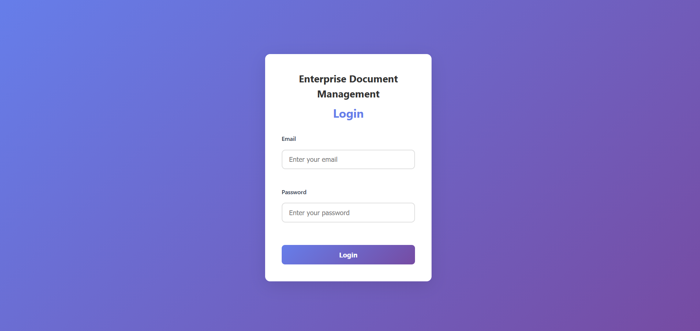

### My Documents - Dashboard
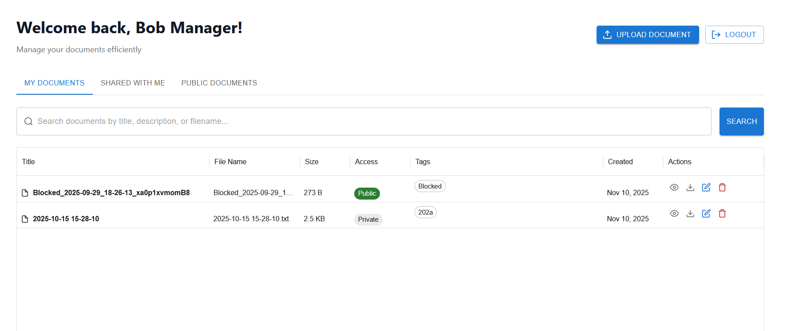

### Document Loading State
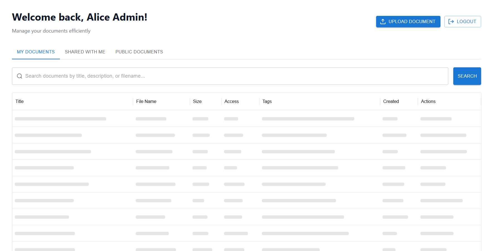

### Search in Progress
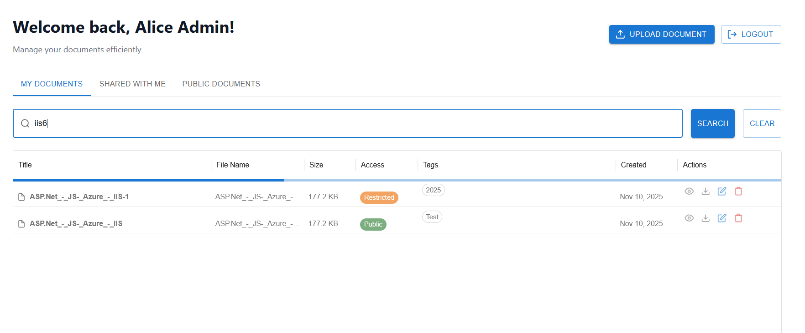

### Search Results
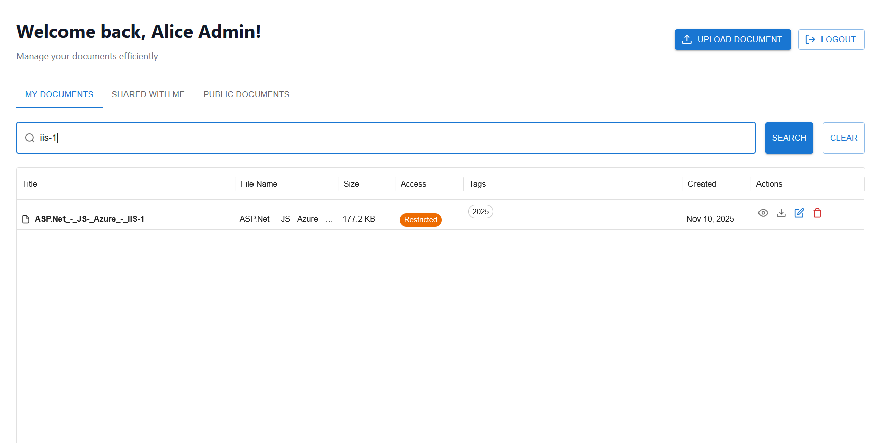

### Delete Document
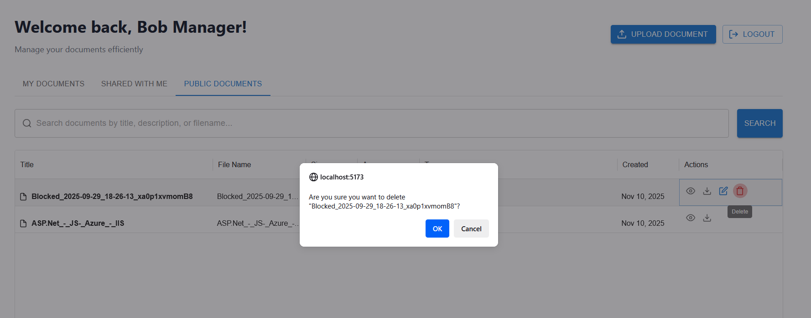

### Shared With Me
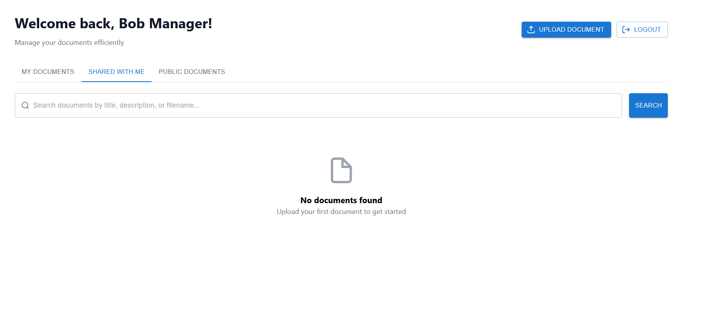

### Public Documents
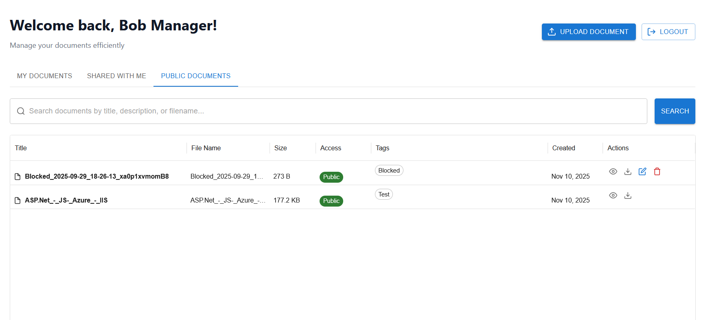

### Upload Document
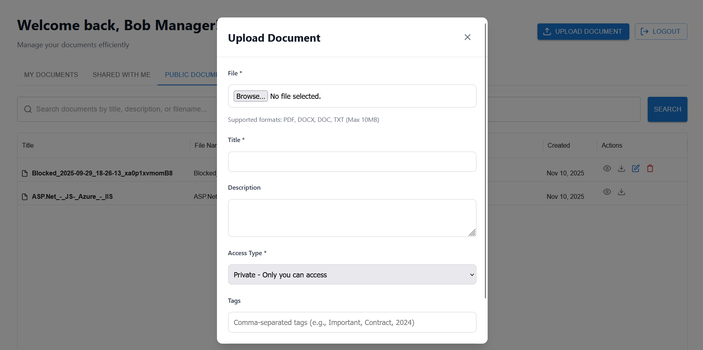

### Edit Document
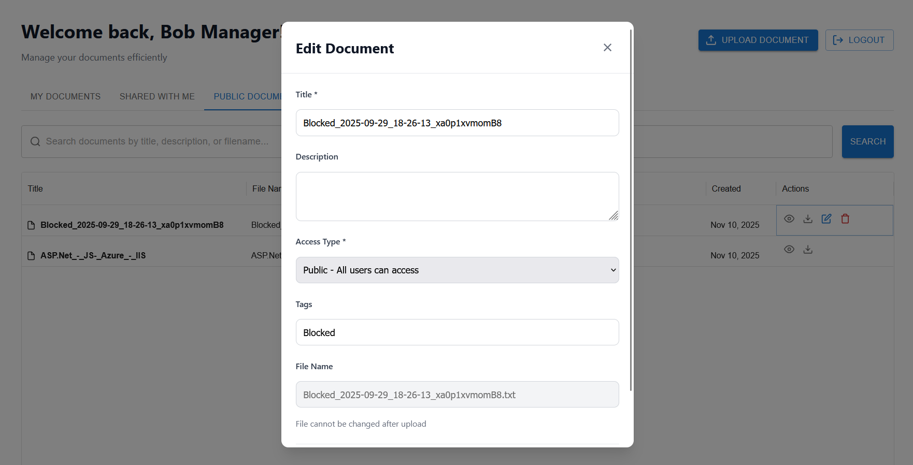

### Swagger API Documentation
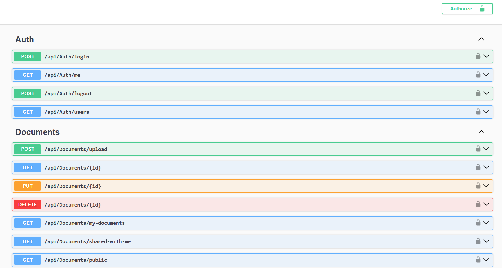

### Database Schema
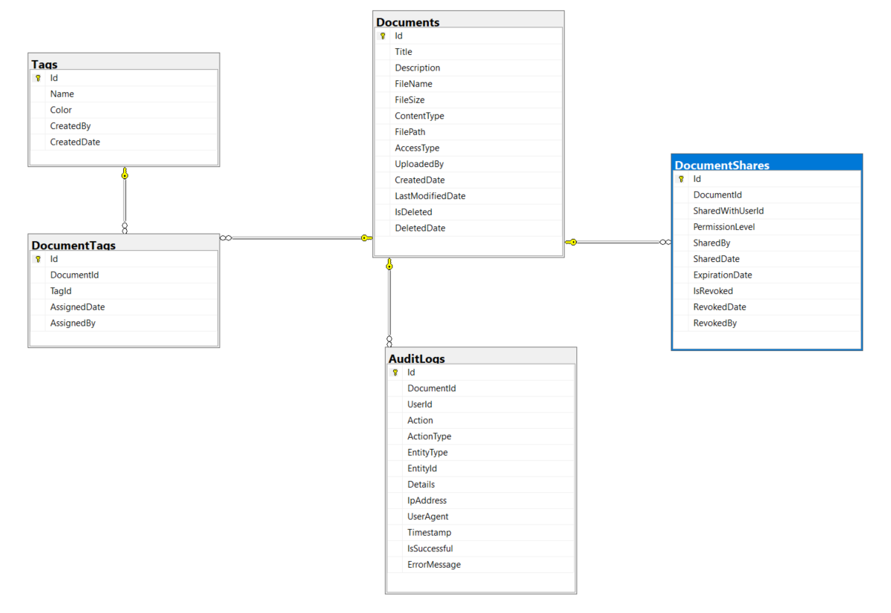

## API Endpoints

### Authentication
- `POST /api/auth/login` - User login
- `GET /api/auth/me` - Get current user
- `POST /api/auth/logout` - Logout
- `GET /api/auth/users` - List users

### Documents
- `POST /api/documents/upload` - Upload document
- `GET /api/documents/{id}` - Get document details
- `GET /api/documents/my-documents` - Get user's documents
- `GET /api/documents/shared-with-me` - Get shared documents
- `GET /api/documents/public` - Get public documents
- `POST /api/documents/search` - Search documents
- `PUT /api/documents/{id}` - Update document
- `DELETE /api/documents/{id}` - Delete document
- `GET /api/documents/{id}/download` - Download document
- `POST /api/documents/share` - Share document
- `GET /api/documents/{documentId}/shares` - Get shares
- `DELETE /api/documents/shares/{shareId}` - Revoke share

### Tags
- `GET /api/tags` - Get all tags
- `GET /api/tags/popular` - Get popular tags
- `POST /api/tags` - Create tag
- `GET /api/tags/{id}` - Get tag by ID
- `DELETE /api/tags/{id}` - Delete tag

## Security Features

- JWT Bearer token authentication
- Role-based authorization policies
- Password hashing (in production implementation)
- CORS configuration
- SQL injection prevention (EF Core parameterized queries)
- File upload validation (type and size)
- Audit logging for compliance

## Development

### API Development
```bash
cd EnterpriseDocumentManagementSystem.Api
dotnet watch run
```

### UI Development
```bash
cd ui
npm run dev
```

### Database Migrations
```bash
# Add migration
dotnet ef migrations add MigrationName

# Update database
dotnet ef database update
```

## Production Deployment

### Backend
1. Update `appsettings.json` with production values
2. Use environment variables for sensitive data
3. Configure proper CORS origins
4. Enable HTTPS
5. Set up logging and monitoring
6. Configure database connection pooling

### Frontend
1. Build the application:
```bash
npm run build
```

2. Deploy the `dist` folder to:
   - Netlify
   - Vercel
   - AWS S3 + CloudFront
   - Azure Static Web Apps

3. Set environment variable:
```
VITE_API_URL=https://your-production-api.com
```

## Documentation

- **[API Documentation](EnterpriseDocumentManagementSystem.Api/README.md)** - Complete backend API documentation
- **[UI Documentation](ui/README.md)** - Complete frontend documentation
- **[Swagger UI](https://localhost:7052/swagger)** - Interactive API documentation (when running)

## Troubleshooting

### API Issues
- Verify SQL Server is running
- Check connection string
- Ensure migrations are applied
- Verify JWT configuration

### UI Issues
- Check API URL in `.env` file
- Verify API is running
- Clear browser cache and localStorage
- Check CORS settings
